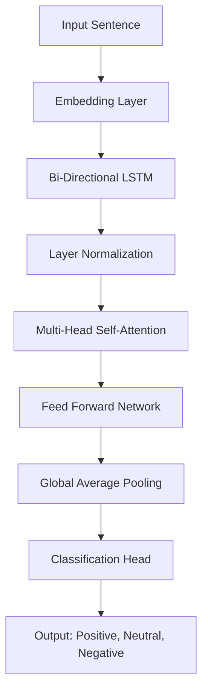

# 🤖 Sentiment Analysis with Sarcasm and Emoji Awareness


## 🧠 Overview

In modern digital communication, sarcasm and emojis can distort textual sentiment, making traditional sentiment analysis models unreliable. This project presents a **lightweight hybrid deep learning model** combining **Bi-directional LSTMs and Multi-Head Self-Attention**, trained on a blended dataset from Kaggle IMDB and custom sarcasm-emoji rich sentences using the **Google Gemini API**.

> 🎯 Achieved **90.90% Accuracy** and **0.91 F1-Score** using a resource-efficient architecture.

---

## 🚀 Features

- ✅ Sarcasm-Aware Sentiment Analysis  
- ✅ Emoji-Aware Contextual Understanding  
- ✅ Lightweight Hybrid Deep Learning Model  
- ✅ Multiple model architectures:
  - ✅ Basic: Attention-based LSTM architecture
  - ✅ Enhanced: Multi-head attention with deeper LSTMs and residual connections
  - ✅ Balanced: Class weighting to handle dataset imbalance
- ✅ Custom Dataset Generation via Gemini API  
- ✅ BERT Tokenizer with Emoji Vocabulary Extension  
- ✅ Fully Integrated PyTorch Training Pipeline  
- ✅ TensorBoard integration for training visualization
- ✅ Model checkpointing and best model saving
- ✅ Class-Weighted Loss Handling  
- ✅ Comprehensive metrics tracking (accuracy, F1 score, confusion matrix)
- ✅ Deployed on Hugging Face 🤗

## Project Structure

- `train.py`: Main script to run the training process
- `models.py`: Neural network model definitions
- `enhanced_models.py`: Advanced model architectures with improved performance
- `dataset.py`: Data loading and preprocessing utilities
- `utils.py`: General utility functions for model initialization and visualization
- `train_utils.py`: Training and evaluation loop functions
- `analyze_results.py`: Script to analyze results without retraining
- `predict_sentiment.py`: Script for making predictions with a trained model
- `train_enhanced.py`: Script to train enhanced models with class balancing
- `analyze_bias.py`: Script to analyze model bias and misclassifications
- `compare_models.py`: Script to compare performance across different models
- `requirements.txt`: Dependencies for the project


## 📂 Dataset

- 📦 [IMDB Sentiment Dataset (Kaggle)](https://www.kaggle.com/datasets/lakshmi25npathi/imdb-dataset-of-50k-movie-reviews)
- 🤖 Custom Sarcasm + Emoji Dataset using Google Gemini API  
- Format: JSON with `sentence` and `polarity` keys  
- Polarity: `-1` = Negative, `0` = Neutral, `1` = Positive  
- Tokenized using `bert-base-uncased` extended with emoji tokens

---


## 🛠️ Model Architecture



---


## 🌐 Deployment

🔗 [Hugging Face Model Endpoint](https://huggingface.co/mnabeel12/sentiment_analysis/tree/main)

---

---
## 📊 Results

| Metric           | Score   |
|------------------|---------|
| **Accuracy**     | 90.90%  |
| **Macro F1**     | 0.9125  |
| **Weighted F1**  | 0.9093  |

**Class-wise Performance:**

| Class     | Precision | Recall | F1-Score | ROC AUC |
|-----------|-----------|--------|----------|---------|
| Negative  | 0.9235    | 0.8939 | 0.8987   | 0.9715  |
| Neutral   | 0.9669    | 0.9427 | 0.9546   | 0.9945  |
| Positive  | 0.8704    | 0.8983 | 0.8841   | 0.9662  |

---

## Setup and Installation

1. Install dependencies:
   ```bash
   pip install -r requirements.txt
   ```

2. Prepare your dataset in the expected format (see `data/final_dataset.json` for reference)

3. Run training:
   ```bash
   python train.py
   ```

## Training Visualization

You can visualize the training process using TensorBoard:

```bash
tensorboard --logdir=runs
```

This will show training metrics, evaluation results, and confusion matrices.

## Model Architecture

The sentiment model architecture:
- Embedding layer initialized with BERT embeddings
- Bidirectional LSTM for sequence processing
- Attention mechanism to focus on important parts of the text
- Fully connected layer for final classification

## Results

After training, results are saved to the `runs` directory with:
- Model checkpoints (best model and latest model)
- Training configuration
- Performance metrics (accuracy, F1 score)
- Confusion matrix visualization
- Detailed classification report

## Using Trained Models

### Enhanced Models for Better Performance

If your model shows bias or poor performance, you can train an enhanced model:

```bash
python train_enhanced.py
```

This will train a more complex model with:
- Multi-head attention mechanism
- Multiple LSTM layers
- Class weighting to handle imbalanced data
- Deeper classification layers with residual connections

Your original model remains intact, and a new model will be saved separately.

### Analyze Model Bias

To understand why your model might be biased toward certain classes:

```bash
python analyze_bias.py
```

This will:
- Analyze your dataset distribution
- Find examples where the model makes errors
- Identify patterns in misclassifications
- Save visualizations of class distribution

### Compare Model Performance

To compare the original and enhanced models:

```bash
python compare_models.py
```

This will generate comparative metrics and visualizations to help you understand the improvements.

### Analyze Results Without Retraining

If you've already completed training and want to analyze the results:

```bash
python analyze_results.py
```

This will load your best model from the most recent training run and generate visualizations and reports.

### Make Predictions with Trained Model

To use your trained model for sentiment analysis on new text:

```bash
python predict_sentiment.py
```

This script loads the best model from your most recent training run and allows you to:
- See predictions on example sentences
- Enter your own text for sentiment analysis

### Model Loading and Inference Example

```python
from predict_sentiment import predict_sentiment
from models import SentimentModel
from utils import load_model
from transformers import BertTokenizer
import torch

# Set device
device = torch.device('cuda' if torch.cuda.is_available() else 'cpu')

# Initialize tokenizer
tokenizer = BertTokenizer.from_pretrained('bert-base-uncased')

# Load the best model
model_path = "runs/sentiment_model_XXXXXX/checkpoints/best_model_epoch_X_f1_X.XXXX.pt"
model, _ = load_model(model_path, SentimentModel, tokenizer, device)

# Make a prediction
text = "I really enjoyed this movie! 😍"
result = predict_sentiment(text, model, tokenizer, device)
print(f"Sentiment: {result['sentiment']} (Confidence: {result['confidence']:.2f}%)")
```

---
## 👥 Authors

- **Muhammad Nabeel** — [@NemroNeno](https://github.com/NemroNeno)
- **Umar Farooq** — [@Umar-Farooq-2112](https://github.com/Umar-Farooq-2112)

---

## 📄 License

This project is licensed under the MIT License - see the [LICENSE](LICENSE) file for details.

---

## 🔗 Resources & References

- [Kaggle IMDB Dataset](https://www.kaggle.com/datasets/lakshmi25npathi/imdb-dataset-of-50k-movie-reviews)
- [GitHub Project Repo](https://github.com/NemroNeno/Sentiment_analysis_Semester_proj.git)
- [Hugging Face Model Deployment](https://huggingface.co/mnabeel12/sentiment_analysis/tree/main)
